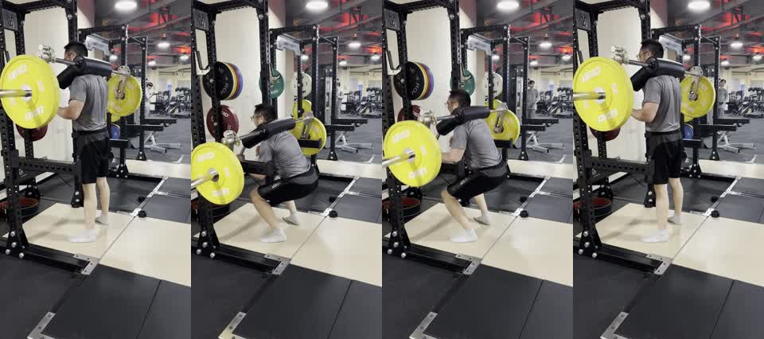

# Barbell Squat 50kg Side-Rear Sample

This is a short public sample for testing Xiaoyu Coach on a free-weight lower-body movement.



## Files

- `barbell_squat_50kg_side_rear_25s.mp4`: compressed 720x1280 H.264 MP4, muted, metadata stripped.
- `preview_contact_sheet.jpg`: four-frame preview for checking the sample quickly in GitHub.

## Video Metadata

| Field | Value |
| --- | --- |
| Exercise | Barbell squat |
| Load label | 50kg |
| Approximate duration | 25.07 seconds |
| Orientation | Vertical phone video |
| Resolution | 720x1280 |
| Audio | Removed |
| Phone/location metadata | Removed |

## Filming Angle

The camera is placed at a side-rear 30-45 degree angle. This angle is useful for checking:

- squat depth
- trunk angle and trunk stability
- bar path relative to the mid-foot
- hip and knee timing during the ascent
- foot pressure and visible lower-body control

It is less useful for checking perfect left-right knee symmetry. A front-oblique angle can be added when knee tracking or stance symmetry is the main question.

## Suggested Test Prompt

```text
Use $xiaoyu-coach to analyze this example barbell squat video as a single-exercise assessment. Focus on squat depth, trunk stability, bar path, hip-knee timing, and safety-priority feedback.
```
