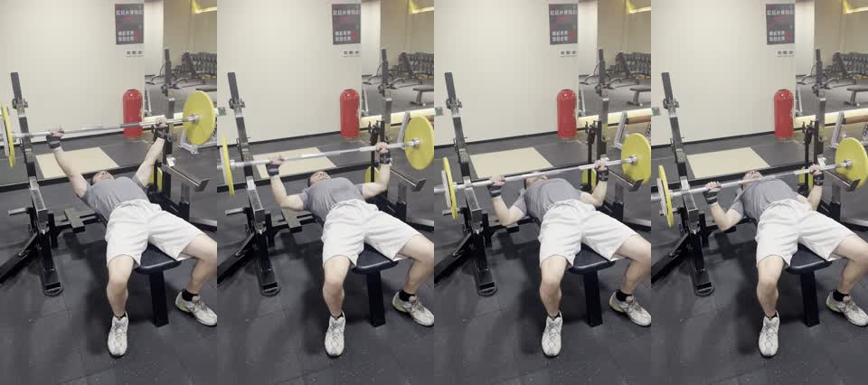

# Bench Press Front-Oblique Sample

This is a short public sample for testing Xiaoyu Coach on a single exercise.



## Files

- `bench_press_front_oblique_15s.mp4`: compressed 720x1280 H.264 MP4, muted, metadata stripped.
- `preview_contact_sheet.jpg`: four-frame preview for checking the sample quickly in GitHub.

## Video Metadata

| Field | Value |
| --- | --- |
| Exercise | Barbell bench press |
| Approximate duration | 15.77 seconds |
| Orientation | Vertical phone video |
| Resolution | 720x1280 |
| Audio | Removed |
| Phone/location metadata | Removed |

## Filming Angle

The camera is placed near the foot end of the bench at a front-oblique angle. This angle is useful for checking:

- whether the bar path is reasonably stable from rep to rep
- whether the wrists stay stacked under the bar
- whether elbow flare is obviously excessive
- whether pressing rhythm slows or loses control across the set
- whether the feet and lower-body setup remain steady

It is not the best angle for judging every bench press detail. A stricter side or rear-side angle would show the touch point, shoulder blade position, arch, and bar depth more clearly.

## Suggested Test Prompt

```text
Use $xiaoyu-coach to analyze this example bench press video as a single-exercise assessment. Focus on safety, pressing path, control, and filming-angle feedback.
```
