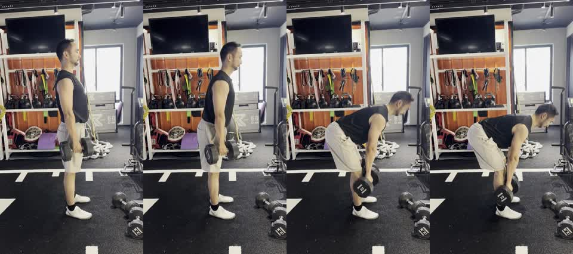

# Dumbbell RDL Side Sample

This is a short public sample for testing Xiaoyu Coach on a hip-hinge movement.



## Files

- `dumbbell_rdl_side_18s.mp4`: compressed 720x1280 H.264 MP4, muted, metadata stripped.
- `preview_contact_sheet.jpg`: four-frame preview for checking the sample quickly in GitHub.

## Video Metadata

| Field | Value |
| --- | --- |
| Exercise | Dumbbell Romanian deadlift / soft-knee straight-leg deadlift |
| Approximate duration | 17.47 seconds |
| Orientation | Vertical phone video |
| Resolution | 720x1280 |
| Audio | Removed |
| Phone/location metadata | Removed |

## Filming Angle

The camera is placed almost directly side-on. This angle is useful for checking:

- whether the movement is led by the hips moving back
- whether the knees stay softly bent instead of locked
- whether the back stays long through the bottom range
- whether the dumbbells travel close to the legs
- whether the lifter tries to force extra depth at the expense of back position

This angle is less useful for checking left-right weight shift. A front-oblique angle can be added when stance symmetry is the main concern.

## Suggested Test Prompt

```text
Use $xiaoyu-coach to analyze this example dumbbell RDL video as a single-exercise assessment. Focus on hip hinge, back position, bottom-range safety, dumbbell path, and filming-angle feedback.
```
