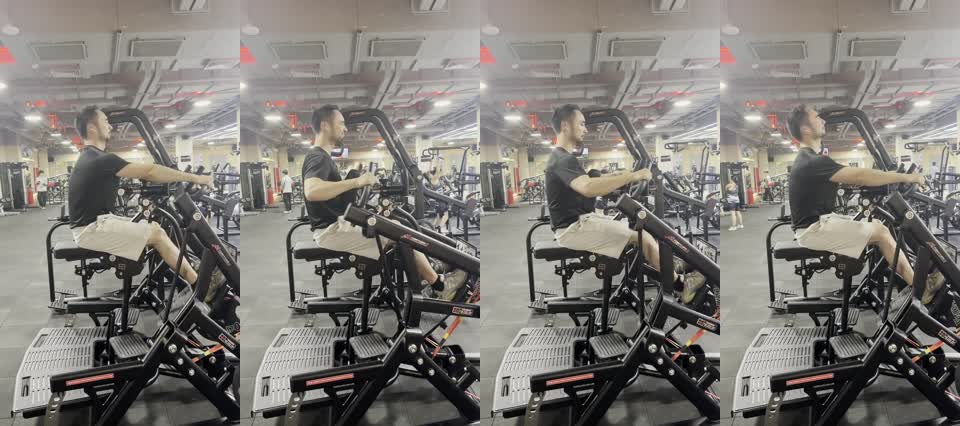

# Open-Elbow Row Front-Oblique Sample

This is a short public sample for testing Xiaoyu Coach on an upper-back rowing movement.



## Files

- `open_elbow_row_front_oblique_24s.mp4`: compressed 720x1280 H.264 MP4, muted, metadata stripped.
- `preview_contact_sheet.jpg`: four-frame preview for checking the sample quickly in GitHub.

## Video Metadata

| Field | Value |
| --- | --- |
| Exercise | Open-elbow row |
| Approximate duration | 23.97 seconds |
| Orientation | Vertical phone video |
| Resolution | 720x1280 |
| Audio | Removed |
| Phone/location metadata | Removed |

## Filming Angle

The camera is placed at a front-oblique angle. This angle is useful for checking:

- whether the elbows stay on a higher rowing path
- whether the shoulders stay away from the ears
- whether the trunk stays stable instead of leaning back to finish the rep
- whether the handle path matches the intended upper-back emphasis
- whether the lifter turns the movement into a regular low row

This angle is especially useful for open-elbow rows because it shows both trunk position and elbow path. A pure rear angle can show back symmetry, but it often hides the handle path and trunk compensation.

## Suggested Test Prompt

```text
Use $xiaoyu-coach to analyze this example open-elbow row video as a single-exercise assessment. Focus on elbow path, shoulder position, trunk stability, handle path, and filming-angle feedback.
```
